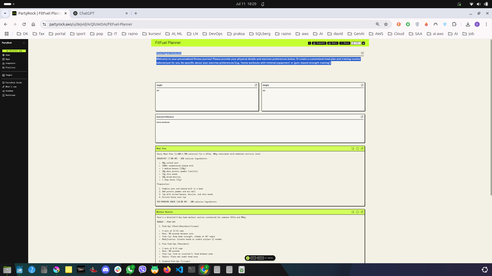

# FitFuel Planner 🥗🏋️‍♂️

An AI-powered fitness planner that helps you generate personalized **meal plans** and **home workout routines** based on your physical stats and activity preferences. Built with [PartyRock by AWS](https://partyrock.aws/u/dejvid/ArQlUWOAl/FitFuel-Planner).

## 🌟 Features

- 🧠 AI-generated meal plans (macros + ingredients)
- 💪 5-day home workout routine — no gym required
- 🧍 Customizable inputs: height, weight, preferences
- 🖥️ Lightweight, responsive UI
- 🔄 Instant results based on your data

## 🚀 Try It Live

👉 [Launch FitFuel Planner on PartyRock](https://partyrock.aws/u/dejvid/ArQlUWOAl/FitFuel-Planner)

## 📸 Screenshots



## 🛠️ Technologies Used

- [AWS PartyRock](https://partyrock.aws/)
- No-code AI builder
- HTML/CSS for static mockups
- Markdown for documentation

## 📂 Project Structure

```plaintext
/
├── index.html         # Landing mockup page
├── style.css          # Minimal styling
├── script.js          # Placeholder for logic (optional)
├── FitnessApp.png     # Screenshot of the app
└── README.md
